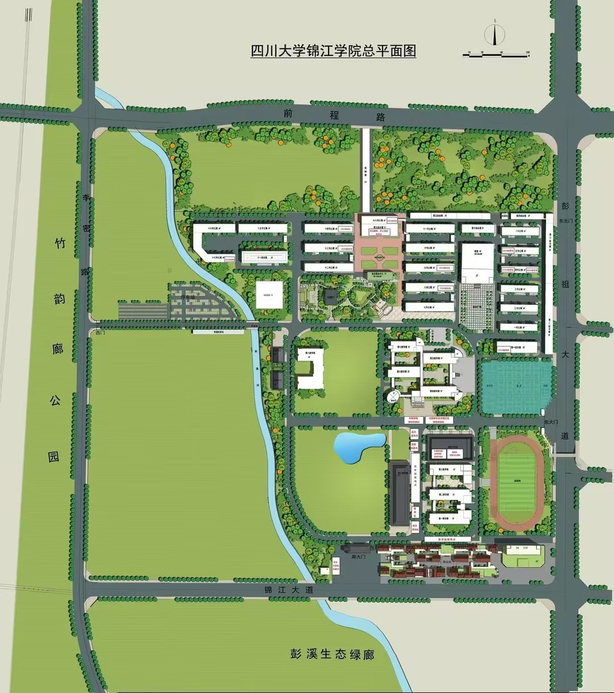

---
AIGC:
  ContentProducer: '001191110102MAD55U9H0F10002'
  ContentPropagator: '001191110102MAD55U9H0F10002'
  Label: '1'
  ProduceID: '09c2bbf1-c29c-4607-99bb-651f83817678'
  PropagateID: '09c2bbf1-c29c-4607-99bb-651f83817678'
  ReservedCode1: '922cd978-65b2-4f1a-b9db-e5486cc512f1'
  ReservedCode2: '922cd978-65b2-4f1a-b9db-e5486cc512f1'
---

# 四川大学锦江学院新生指南知识库

> 数据来源: 用户提供材料《新生问答2026新版》+ 学校官网采集
> 更新日期: 2026-08-06

---

## 一、你好，新同学

### 学校简介

**全称**：四川大学锦江学院（Sichuan University Jinjiang College）

**创办**：2006年4月经教育部批准，由四川大学和四川旭峰实业有限公司合作举办的普通本科高等学校。是教育部直属全国重点大学、"双一流"建设高校——四川大学举办的独立学院。学校为四川省硕士学位授予立项建设单位，拥有四川省"双一流"建设贡嘎计划建设学科。

**校训**：尊德性而道问学，致广大而尽精微
- 出处：《礼记·中庸》
- 释义："尊德性而道问学"——坚守道德本心、涵养品德，同时勤学善思、钻研学问，做到德才兼备；"致广大而尽精微"——胸怀远大理想与格局，大处着眼规划人生，做事深耕细节、精益求精、脚踏实地。

**办学理念**：学生为本，通专并重，知行合一，教学相长
**锦江精神**：以人为本，求真务实，追求卓越
**办学目标**：创全国一流本科大学，建中国式的小常青藤

**校史关键节点**：
- 2006年4月12日：教育部正式批复建校，校址定在眉山彭山；同年9月首届1600余名新生入学
- 2008年：获评全国学生最信赖十佳独立学院
- 2012年：获批学士学位授予单位
- 2014年：正式在四川本科二批招生
- 2020年：获评四川省十佳心育学校、四川省文明校园
- 2022年：入选全国高水平独立学院十强
- 2024年：成为四川首批硕士学位立项建设单位
- 2026年：建校20周年，累计向社会输送近7万名应用型人才

**规模**：校园占地1200余亩，在校生26000余人，专任教师1000余人（1/3以上为副教授或教授）。设有12个二级学院、2个产业学院，50个本科专业和17个专科专业，涵盖经济学、法学、教育学、文学、工学、管理学、艺术学7大学科门类。

**学院与本科专业设置**：

| 学院 | 本科专业 |
|------|----------|
| 数字经济学院 | 数字经济、经济学、电子商务、国际经济与贸易、经济与金融 |
| 商学院 | 会计学、财务管理、审计学、人力资源管理、大数据管理与应用 |
| 机械工程学院 | 机械设计制造及其自动化、机器人工程、智能制造工程 |
| 白酒学院 | 酿酒工程、食品质量与安全 |
| 人工智能科大讯飞学院 | 人工智能、智能科学与技术、数据科学与大数据技术 |
| 电气与电子信息工程学院 | 电气工程及其自动化、电子信息工程、通信工程、自动化 |
| 计算机学院 | 计算机科学与技术、软件工程、物联网工程、人工智能、智能科学与技术 |
| 土木工程学院 | 土木工程、工程造价 |
| 外国语学院 | 英语（限英语语种） |
| 文学与传媒学院 | 汉语言文学、新闻学、网络与新媒体 |
| 艺术学院 | 舞蹈表演、环境设计、视觉传达设计、播音与主持艺术、戏剧影视导演、产品设计 |
| 体育学院 | 体育教育 |

**专科专业（12个）**：金融服务与管理、大数据与会计、工业机器人技术、大数据技术、计算机应用技术、建筑装饰工程技术、工程造价（专科）、智能建造技术、无人机测绘技术、舞蹈表演、环境艺术设计、艺术设计（多个方向）

**标志性建筑**：
- **南大门**：高18.65m、长59.9m，门前广场4500㎡，极简中式平顶设计，新生打卡、毕业合影首选地
- **第四教学楼**：凹字形围合结构，文科教学楼（汉语言、经管、外语学院主要教学楼）
- **十教**：全校现代化最高的教学楼，配备全息投影、虚拟仿真、多屏互动智慧教室，理工科、AI专业核心授课场地
- **学术会堂**：588㎡，442个座椅，43㎡高清大屏、影院级音响，开学典礼、毕业晚会、学术论坛通用场地
- **杏坛广场**：食堂门前中心广场，取名源自孔子杏坛讲学，社团招新、音乐节、市集聚集地
- **图书馆**：2009年正式揭牌，承袭川大图书馆治学传统，考研考公主要自习地
- **南草坪**：校门内侧大片草坪，春秋演唱会、露营、班级团建常用场地

### 校区概况

- 学校位于成都都市圈重要组成部分——眉山市彭山区
- 校园面积1200余亩，按人文化、生态化、数智化理念规划建设
- 单一校区，无多校区接驳需求

### 重要电话与网址

| 部门 | 电话 | 网址/邮箱 |
|------|------|-----------|
| 招生办公室 | **028-37666666** | zs@scujj.edu.cn |
| 总值班室（24h） | **028-37600000** | — |
| 保卫处 | **028-37600110** | — |
| 校医院 | **028-37600120** | — |
| 学生工作部 | **028-37600201** | xgb@scujj.edu.cn |
| 教务处 | **028-37600202** | jwc@scujj.edu.cn |
| 招生就业处 | **028-37666666** | jobscujj@126.com |
| 三创中心 | **028-37600222** | — |
| 党委组织部 | **028-85403005** | — |
| 后勤报修 | **028-37600114** | — |
| 心理咨询中心 | **028-37600339** | — |
| 学校官网 | — | **www.scujj.edu.cn** |
| 招生信息网 | — | **zs.scujj.edu.cn** |
| 教务管理系统 | — | **jwc.scujj.edu.cn** |
| 迎新系统 | — | **yx.scujj.edu.cn** |
| 图书馆 | — | **lib.scujj.edu.cn** |
| 就业网 | — | **jy.scujj.edu.cn** |

**校园媒体**：
- 抖音：四川大学锦江学院、四川大学锦江学院招办、青春锦江
- 微信公众号：四川大学锦江学院、四川大学锦江学院图书馆

---

## 二、报到全流程

### 报到前准备

**报到时间**：2026年9月9日至10日

**必备材料**：
1. 录取通知书（必须携带）
2. 身份证原件
3. 准考证
4. 肺结核皮试报告、胸片
5. 党、团组织关系转接证明（开学典礼后2天内交辅导员处）
6. 一寸和二寸白底照片多张（校园卡、学生证、申请部门等会用到，建议提前拍好）
7. 体检报告（交辅导员）

**宿舍用品建议**：

| 推荐 | 避雷 |
|------|------|
| 学校统一床上用品（约300元/套）或自带（床尺寸0.9m×2.0m） | 不要买1.0m宽的床垫 |
| 床帘（军训后装，高度≤1.5m） | 不要买电煮锅、热得快 |
| 收纳盒、鞋架（小尺寸） | 不要带宠物 |
| 小锁2把、衣架20个 | 不要带自行车（校园小） |

### 线上预报到

- 迎新系统网址：**http://yx.scujj.edu.cn**（可查询分班、课表等信息）
- 可通过"迎新管理系统"在线了解报到事宜

### 报到当天路线

**报到流程**：
1. 到南门，持录取通知书进入（家长可陪同）
2. 找到学院迎新帐篷 → 核验身份
3. 找到辅导员，交体检报告，领宿舍钥匙、校园卡（预存100元）
4. 到南门保安室录脸部信息，方便后续进出校门
5. 买了学校床上用品的到学生活动中心领取，同时领取军训用品
6. 到宿舍楼登记入住
7. 到街电信营业厅办理校园网

**从成都东站到校**：
- 站内换乘高铁至彭山北站（每天约30趟），车程30分钟，二等座26元
- 从彭山北站到校：打车5分钟5-8元；公交51路到"锦江学院站"

**从双流机场到校（最常用）**：

| 方式 | 步骤 | 耗时 | 费用 | 推荐度 |
|------|------|------|------|--------|
| 高铁 | 双流机场站→彭山北站（C字头）→打车 | 40分钟 | 27+8=35元 | ⭐⭐⭐⭐⭐ |
| 打车 | 直接网约车到校 | 1小时 | 50-70元 | ⭐⭐⭐⭐（拼车） |
| 地铁+高铁 | 10号线→成都南站→彭山北站 | 1.5h | 12+27=39元 | ⭐⭐⭐ |

**从天府机场到校**：

| 方式 | 耗时 | 费用 | 推荐度 |
|------|------|------|--------|
| 打车 | 1.5h | 180-220元 | ⭐⭐⭐（3-4人拼车） |
| 地铁+高铁 | 2.5h | 35+27=62元 | ⭐⭐ |

**⚠️ 重要提醒**：高铁票必须买到"彭山北站"，不是"眉山东站"。

**自驾**：导航"四川大学锦江学院"（眉山市彭山区锦江大道1号）

### 报到手续清单

1. 南门持录取通知书入校
2. 学院迎新帐篷核验身份
3. 辅导员处交体检报告、领宿舍钥匙和校园卡（预存100元）
4. 南门保安室录入人脸信息
5. 学生活动中心领取床上用品和军训用品
6. 宿舍楼登记入住
7. 办理校园网

### 绿色通道与助学贷款

- **助学贷款**：需学生本人及家长凭借录取通知书、身份证在开学前前往当地可助学贷款的银行办理
- **绿色通道**：开学报到时前往锦江大礼堂进行身份验证

### 户口迁移与医保参保

- **政策**：户籍迁移遵循自愿原则
- **办理流程**：凭录取通知书和本人户口簿到户籍所在地公安机关办理《户口迁移证》→ 入学时交保卫处办理入户手续
- **户口关系转至**：四川省眉山市彭山区锦江大道1号四川大学锦江学院
- **截止**：报到后一个月内未迁入的视为不迁移，农业户口不迁入的可就地农转非

---

## 三、校园地图

### 全校鸟瞰图

### 教学区

| 编号 | 名称 | 功能 | 开放时间 | 备注 |
|------|------|------|----------|------|
| B | 第一教学楼 | 文科课程 | 7:00-22:00 | 4楼为外国语学院语音室 |
| C | 第二教学楼 | 理工课程、计算机房 | 7:00-22:00 | 2楼计算机基础实验室 |
| D | 第三教学楼 | 艺术、传媒 | 7:00-21:30 | |
| E | 第四教学楼 | 数字经济、商学院 | 7:00-22:00 | 凹字形围合结构 |
| F | 第五教学楼 | 机械、土木 | 7:00-21:30 | |
| G | 图书馆 | 自习、借阅 | 8:00-22:00 | 节假日8:30-17:30 |

### 生活区

| 编号 | 名称 | 功能 | 开放时间 | 备注 |
|------|------|------|----------|------|
| A | 南大门 | 主出入口，人脸识别 | 全天 | 报到日开放所有通道 |
| H | 一食堂 | 大众快餐 | 6:30-19:00 | 一楼便宜 |
| J | 学生活动中心 | 社团、心理咨询 | 8:30-21:00 | 三楼心理咨询中心 |
| L | 女生宿舍区 | 5-14栋，六人间 | 门禁23:00 | 周末23:30 |
| M | 男生宿舍区 | 1-4,15-20栋，五人间/六人间；第一综合楼 | 门禁23:00 | 7-10栋公共卫浴，第一综合楼独立卫浴 |
| N | 快递中心 | 菜鸟驿站+顺丰京东 | 9:00-19:00 | 后街旁 |
| O | 校医务室 | 基础医疗 | 8:30-17:30 | 夜间有值班 |
| P | 后街商业区 | 餐饮、打印、超市 | 8:00-23:00 | 校外侧门进出 |

### 运动区

| 编号 | 名称 | 功能 | 开放时间 | 备注 |
|------|------|------|----------|------|
| K | 田径场 | 体育课、军训 | 全天开放 | 夜灯至21:30 |
| L | 体育馆 | 篮球、羽毛球 | 8:00-21:00 | 一直开放 |

### 行政区

- 校医务室位于南门西侧
- 学生活动中心3楼设心理咨询中心
- 学生活动中心1楼设卡务中心（校园卡补办）
- 保卫处负责户籍迁移办理

### 常用路线

校园面积适中，步行可达各区域。宿舍区到教学区步行约5-10分钟。

---

## 四、宿舍生活

### 宿舍类型与分配规则

**女生宿舍（5-14栋）——六人间**：
- 布局：三连体组合床（上床下三桌+三柜）共两套，面对面摆放
- 床尺寸：0.9m×2.0m
- 独立卫浴：蹲便+淋浴花洒，燃气热水器（插校园卡取水）
- 阳台：洗手池、晾衣杆、镜子

**男生宿舍——五人间**：
- 布局：两个上铺+一个下铺+一张上下铺；三人桌+两人桌；每人铁皮柜
- 床尺寸：0.9m×2.0m
- 公共卫浴：每三个五人间共用2蹲位+3淋浴位（前两个有隔板，第三个无）
- 无阳台：晾衣在楼道或室外公共区

**男生宿舍——六人间**：
- 配置同女生楼

**男生宿舍（第一综合楼）——六人间**：
- 布局：两个下铺+两个上下铺；每人一个实木柜
- 床尺寸：0.9m×2.0m
- 独立卫浴：马桶+淋浴花洒，燃气热水器（插校园卡取水），洗漱台，半身镜
- 阳台：洗手池，晾衣杆，镜子

**常见问答**：
- Q：可以调宿舍吗？A：原则上不能。特殊情况向辅导员申请，开学一个月后可能调。
- Q：有蟑螂吗？A：低楼层偶有。保持干燥，可买蟑螂药（校内超市有售）。

### 宿舍设施

- **空调**：已安装，遥控器押金20元（毕业退还）
- **电费**：0.55元/度，公众号"锦江校园卡"充值
- **限电**：≤800W，禁用大功率电器（电煮锅、电热毯、卷发棒）
- **吹风机**：只能在走廊专用插座使用
- **洗衣机**：每栋1楼公共，4-5元/次
- **饮水**：每层走廊直饮水机
- **网络**：宿舍无Wi-Fi，需自办校园网
- **热水供应**：6:30-8:30，12:00-14:00，17:00-23:30

### 宿舍公约与作息

- 周日至周四晚上23:00寝室断电断网（阳台和卫生间不断电），早上6:30来电，节假日除外
- 晚上23:00前需回寝，否则会被宿管登记
- 注意寝室内务整理

### 水电费充值

- **电费**：公众号"完美校园"→缴费→选择宿舍楼栋+房间号
- **水费**：部分宿舍热水需插校园卡（充值在食堂一楼自助机）

### 宿舍报修

- **线上**：锦江微服务→"后勤报修"→填写故障+照片→24小时内上门
- **线下**：到寝管处进行报修
- **紧急维修**：**028-37600114**

### 门禁与访客

- **门禁时间**：23:00（周末23:30）
- 违反《学生宿舍安全管理规定》的，予以警告和严重警告处分；多次违反的，给予记过、留校察看或开除学籍处分

### 住宿费

1400元/年或2000元/年（以入学须知为准）

---

## 五、吃喝在校

### 食堂分布与特色

| 食堂 | 楼层 | 推荐 | 人均 | 营业时间 |
|------|------|------|------|----------|
| 一食堂 | 1楼 | 快餐、煎饼 | 8-12元 | 6:30-9:00, 11:00-13:00, 17:00-19:00 |
| 一食堂 | 2楼 | 米线、猪脚饭、冒菜 | 10-15元 | 午晚餐 |

### 食堂营业时间

- 一食堂：6:30-19:00（分早中晚三个时段）

### 支付方式

- 校园卡（食堂就餐、水电充值、进出图书馆、门禁等通用）

### 校内其他餐饮

后街商业区有丰富的餐饮选择（详见第十五章）

### 校外后街精选（常驻店铺）

**粉面类**：
| 店铺 | 推荐菜品 | 价格 |
|------|----------|------|
| 兰州拉面 | 番茄鸡蛋烩刀削 | 12-18元 |
| 姜鸭面 | 干拌姜鸭面（怕辣选汤面） | 13元 |
| 土鸡米线 | 土鸡米线、瓦香排骨饭（送饮料） | 15元 |
| 绵阳米粉 | 红汤牛肉 | 10元 |
| 柳州螺蛳粉 | — | 12元 |

**饭食类**：
| 店铺 | 推荐菜品 | 价格 |
|------|----------|------|
| 隆江猪脚饭 | 猪肘拼烤鸭 | 15-20元 |
| 王记炒饭 | 酱肉丝炒饭（送银耳汤） | 12元 |
| 石锅饭 | 石锅鸡蛋 | 15元 |
| 黄焖鸡米饭 | — | 18元 |
| 台湾卤肉饭 | — | 14元 |

**干锅/炒菜/聚餐**：
| 店铺 | 推荐 | 人均 |
|------|------|------|
| 干锅王 | 干锅排骨（提前扫码点餐） | 20元 |
| 鑫隆稀饭 | 烂肉粉丝、藤椒鱼 | 30元 |
| 花雕醉鸡 | 花雕鸡+刀削面（发朋友圈送菜） | 25元 |
| 滋味烤鱼 | 烤黔鱼 | 40元 |

**小吃/甜品/奶茶**：
| 店铺 | 推荐 | 价格 |
|------|------|------|
| 纵苇时令糖水 | 双皮奶、杨枝甘露（两人一份） | 16元 |
| 蜜雪冰城 | 柠檬水 | 4元 |
| 茶百道/书亦/瑞幸/古茗 | — | — |
| 烤苕皮/狼牙土豆/炸鸡柳 | — | 5-8元 |
| 冰粉/烤面筋 | — | 3-8元 |

### 外卖

- 美团/饿了么送至南门或东门栅栏取餐
- 取餐及时防止被盗

### 周边美食

详见校外后街精选部分及第十五章

---

## 六、生活设施与营业时间

### 澡堂/浴室

- 女生宿舍：独立卫浴（蹲便+淋浴花洒），燃气热水器插校园卡取水
- 男生五人间：公共卫浴，每三个五人间共用2蹲位+3淋浴位
- 第一综合楼：独立卫浴（马桶+淋浴花洒）
- 热水供应：6:30-8:30，12:00-14:00，17:00-23:30

### 开水房

- 每层走廊直饮水机

### 洗衣房

- 每栋1楼公共洗衣机，4-5元/次

### 打印复印

- 后街商业区有文印店（8:00-23:00营业）

### 快递收发

- **邮寄地址**：四川省眉山市彭山区锦江大道1号四川大学锦江学院+姓名+电话
- **快递点**：菜鸟驿站（中通、圆通、韵达、申通、极兔等）+ 顺丰/京东单独门店 + 后街邮政快递站
- **取件流程**：菜鸟APP取件码→到驿站找件→出库扫描身份码
- **营业时间**：9:00-19:00（高峰期延长至21:00）
- **大件行李**：提前3-5天寄出，到校后2天内取走，超期退回

### 理发店

后街商业区有理发店（8:00-23:00营业）

### 超市与便利店

- 校内有超市（蟑螂药等日用品有售）
- 后街商业区有超市（8:00-23:00）

### 银行ATM

暂无详细信息，建议到校后咨询辅导员

### 通讯营业厅

- **后街电信营业厅**（瑞幸咖啡旁）
- 营业时间：周一至周日9:00-18:00
- 需携带身份证原件
- 可办业务：手机卡、校园宽带

### 水电充值

- **电费**：公众号"完美校园"→缴费→选择宿舍楼栋+房间号
- **水费**：部分宿舍热水需插校园卡（充值在食堂一楼自助机）

### 宿舍报修

- **线上**：锦江微服务→"后勤报修"→填写故障+照片→24小时内上门
- **线下**：到寝管处进行报修
- **紧急维修**：**028-37600114**

### 校园网与信息化

**校园网必要性**：
- 选课、查成绩、交作业必须通过校园内网（外网无法访问教务系统）
- 知网等学术资源免费下载（需校园网IP）
- 宿舍无宽带，手机热点不稳、延迟高
- **强烈建议办理**

**办理方式**：

1. **线上办理（推荐）**：暑期扫码支付办理，免排队；预约后不办可退费；暑期福利：激活后免月租至9月（具体以电信公告为准）
2. **线下办理**：后街电信营业厅（瑞幸咖啡旁），周一至周日9:00-18:00，需携带身份证原件

**资费套餐（2026年）**：
- 月费69/79元（含校园宽带+手机卡+流量）
- 寒暑假享专属优惠
- 校园流量覆盖彭山区，全国流量假期可用
- 具体套餐内容以营业厅最新公告为准
- 每月校园网会有活动为同学发放福利

**常见故障解决**：

| 问题 | 解决方法 |
|------|----------|
| 连不上 | 重启路由器/电脑，检查网线 |
| 掉线 | 高峰期正常，避开选课高峰 |
| 慢 | 有线比无线稳定，建议插网线 |
| 多设备 | 可开手机热点共享，但会降速 |

---

## 七、运动与休闲

### 田径场/操场

- 位置：校园内（编号K）
- 开放时间：全天开放，夜灯至21:30
- 用途：体育课、军训、校运会

### 体育馆

- 位置：校园内（编号L）
- 开放时间：8:00-21:00
- 设施：篮球、羽毛球

### 社团活动中心

- 学生活动中心（编号J）：社团活动、心理咨询
- 开放时间：8:30-21:00
- 杏坛广场：社团招新、音乐节、市集聚集地

### 校园周边娱乐

后街商业区（餐饮、打印、超市，8:00-23:00）及周边商圈

---

## 八、军训攻略

### 军训时间安排

- 军训在报到后开始（9月10日报到结束后）
- 军训服装领取时间：报到后第二天，地点南门体育馆

### 服装与物资准备

**统一发放**：帽子1、短袖2、外套1、裤子2、皮带1（建议自备腰带，裤子腰围偏大）
**鞋子**：1双，建议买大一码放鞋垫（鞋底硬）

**必备好物（12件）**：
1. 防晒霜（安热沙、蜜丝婷等，SPF50+）
2. 驱蚊水
3. 湿纸巾（大包）
4. 小电扇（⚠️可能被收，看教官）
5. 鞋垫（卫生巾鞋垫亲测好用）
6. 藿香正气水
7. 大容量水杯（1.5L+）
8. 腰带（自备）
9. 润喉糖
10. 小夹子（夹帽子）
11. 针线包（衣服易开线）
12. 冰凉贴

**必备药品（18种）**：

| 类别 | 药品 |
|------|------|
| 防中暑 | 藿香正气水、十滴水 |
| 外伤 | 云南白药气雾剂、红花油、创可贴、碘伏、棉签、纱布 |
| 腹泻 | 蒙脱石散、黄连素 |
| 感冒发烧 | 感冒灵、布洛芬 |
| 皮肤 | 红霉素软膏、芦荟胶（晒后修复） |
| 嗓子 | 润喉片、西瓜霜 |
| 营养 | 维生素C泡腾片、钙片 |
| 防蚊 | 驱蚊水、风油精 |
| 防晒 | 防晒霜（SPF50+） |

### 训练内容与作息

**军训日程表**：

| 时间段 | 内容 |
|--------|------|
| 7:30-8:00 | 早餐 |
| 8:30-12:00 | 上午训练 |
| 12:00-14:00 | 午餐+午休 |
| 14:30-18:00 | 下午训练 |
| 18:00-19:00 | 晚餐 |
| 19:30-21:00 | 晚间拉歌/讲座 |
| 21:00-22:30 | 自由活动 |
| 23:00 | 熄灯 |

### 伤病防治

- **皮肤损伤**：做好防晒，及时擦汗
- **中暑**：服用十滴水/藿香正气液，喝凉盐开水
- **扭伤**：冰敷，弹力绷带固定
- **腹痛**：热敷，按压拉伸
- **抽筋**：补钙，局部热敷

### 纪律与请假制度

- 统一着装，严格遵守作息时间
- 不迟到、不早退，一切行动听指挥
- 注意寝室内务整理
- 请假：需持校医院证明或辅导员批准，否则按旷训处理
- 军训期间严禁使用手机（休息时间可用）

### 军训汇演

暂无详细信息，以学校通知为准

### 常见问题

军训期间注意防晒补涂、多喝水，鞋垫建议提前准备，裤子腰围偏大需自备腰带

---

## 九、学习指南

### 选课流程

- 大学期间选修课为每学期开学1-3周内选择
- 根据自身专业、兴趣等选择适配的选修课
- 选课时登录教务系统进行选课

### 课表查询

- 登录迎新/教务系统：**http://yx.scujj.edu.cn**
- 教务管理系统：**jwc.scujj.edu.cn**

### 图书馆

- **进馆须知**：需本人持校园卡刷卡进入
- **开放时间**：6:30-22:30（节假日8:30-17:30）
- **借阅规则**：凭校园卡借阅，每次最多可借阅10本图书，期限为一个月
- **续借**：一月后可登录四川大学锦江学院图书馆网页版续借，或本人持校园卡到图书馆续借
- **电子资源**：可登录图书馆网页版查阅

### 自习室

- 图书馆为考研、考公主要自习地
- 学校在学生学习中心、图书馆为考研学子设置专用自习室

### 教务系统

- 网址：**jwc.scujj.edu.cn**
- 常用功能：成绩查询、选课、课表查询、成绩单打印等
- 成绩查询路径：信息查询→成绩查询→选择学年和学期

### 英语四六级

报名时间以教育部考试中心通知为准，一般每年3月和9月报名，6月和12月考试

### 绩点计算

- **计算规则**：期末成绩×70% + 综测成绩×30%
- **补考重修**：挂科需开学时补考，若补考未过则科目重修
- **成绩查询**：放假后2-3周可登录教务系统查阅期末成绩

### 转专业

- **时间**：大一第一学期期末申请，第二学期开学初公布结果
- **条件**：无违纪、无挂科、原专业成绩排名前50%（热门专业要求更高）
- **限制**：艺术类不能转普通类；文科不能转理科（看高考科目）
- **流程**：提交申请表→原学院审批→目标学院考核（笔试/面试）→学校公示
- **成功率**：约70%（热门专业如会计学、计科竞争激烈）

### 辅修/双学位

- **开设专业**：英语、计算机科学与技术等（以当年通知为准）
- **学制**：2年，大二开始
- **学费**：按学分收取（约100元/学分）
- **证书**：辅修证书（无学位）或第二学士学位证书（需完成毕业论文）

### 保研/考研信息

**保研**：学校没有保研资格（不能推荐免试攻读硕士研究生），只能通过全国统考考研

**2026届考研数据**：
- 报名778人，279人被高校录取为硕士研究生
- 考试上线率：57.8%
- 考试录取率：35.9%
- 上线录取率：62.0%

**学校考研支持**：
1. **东坡学院**：免费考研辅导（英语、政治、专业课），周末上课
2. 考研公共课程答疑辅导（英语、数学、政治等）
3. 专用自习室（学生学习中心、图书馆）
4. 心理疏导（考研关键期专业心理咨询师减压赋能）
5. 经验分享会、志愿填报指导
6. 每年考研动员会（约5月召开）

---

## 十、出行交通

### 校内出行

校园面积适中，步行可达各区域。校园小，不建议带自行车。

### 校外公交

- 公交51路到"锦江学院站"（从彭山北站到校）

### 火车/高铁/飞机

**从成都东站到校**：
- 站内换乘高铁至彭山北站（每天约30趟），车程30分钟，二等座26元
- 从彭山北站到校：打车5分钟5-8元；公交51路

**从双流机场到校（最常用）**：

| 方式 | 步骤 | 耗时 | 费用 | 推荐度 |
|------|------|------|------|--------|
| 高铁 | 双流机场站→彭山北站（C字头）→打车 | 40分钟 | 35元 | ⭐⭐⭐⭐⭐ |
| 打车 | 直接网约车到校 | 1小时 | 50-70元 | ⭐⭐⭐⭐ |
| 地铁+高铁 | 10号线→成都南站→彭山北站 | 1.5h | 39元 | ⭐⭐⭐ |

**从天府机场到校**：
- 打车：1.5h，180-220元（3-4人拼车推荐）
- 地铁+高铁：2.5h，62元

**从彭山北站到校**：
- 打车：5分钟，5-8元
- 出租车拼车：5分钟，5元
- 公交：51路到"锦江学院站"

**⚠️ 重要提醒**：高铁票必须买到"彭山北站"，不是"眉山东站"。

### 自驾

导航"四川大学锦江学院"（眉山市彭山区锦江大道1号）

### 周末出行

暂无详细信息，建议到校后探索周边

---

## 十一、医疗与安全

### 校医院

- **位置**：南门西侧（编号O）
- **门诊时间**：8:30-17:30，夜间有值班
- **电话**：**028-37600120**
- 可处理感冒、外伤、开常用药
- 医保报销需持学生证、社保卡

### 周边医院

| 医院 | 等级 | 地址 | 距离 | 备注 |
|------|------|------|------|------|
| 彭山区人民医院 | 二甲 | 彭山区蔡山北路西二段195号 | 打车10分钟 | 电话028-37623825 |
| 眉山市人民医院 | 三甲 | — | 打车30分钟 | 急诊120 |

### 心理咨询中心

- **位置**：学生活动中心3楼（编号J）
- **预约电话**：**028-37600339**
- **开放时间**：周一至周五14:30-17:30（需提前一天预约）
- 免费、保密

### 校园安保

- **保卫处电话**：**028-37600110**
- **总值班室（24h）**：**028-37600000**
- 南大门设人脸识别系统

### 防诈骗

警惕校园常见诈骗类型：刷单诈骗、校园贷、推销诈骗等

### 消防安全

- 宿舍限电≤800W，禁用大功率电器（电煮锅、电热毯、卷发棒）
- 吹风机只能在走廊专用插座使用
- 违反《学生宿舍安全管理规定》将受处分

---

## 十二、财务管理

### 学费住宿费

**学费（2025年标准，2026年以招生简章为准）**：

| 类别 | 学费 |
|------|------|
| 本科普通类 | 17000元/年 |
| 本科艺术类 | 20000元/年 |
| 专科 | 17000元/年 |

- **住宿费**：1400或2000元/年
- **代收教材费**：800元/年
- **校园卡预存**：100元

**缴费方式**：公众号"锦江学院财务处"在线缴费 / 银行代扣

### 一卡通

**校园卡功能**：食堂就餐、水电充值、进出图书馆、门禁等

**校园卡补办**：
1. 丢失后立即在公众号"锦江校园卡"（或"完美校园"）挂失
2. 补办地点：学生活动中心1楼卡务中心
3. 补办费用：20元
4. 需带身份证
5. 每日限额20元，超出需输入密码，密码默认身份证后六位

### 奖学金助学金

| 奖项 | 金额 | 条件 | 名额/比例 | 申请时间 |
|------|------|------|-----------|----------|
| 优秀学生奖学金 | 一等1000、二等600、三等200 | 专业前25%，无挂科无处分 | 专业人数15% | 9-10月 |
| 张桂芳励志奖助学金 | 10000 | 贫困+学业/综测前30% | 全校30人 | 9月中旬 |
| 章文晋奖学金 | 以通知为准 | 成绩优秀+综合表现 | 若干 | 9-10月 |
| 国家奖学金 | 8000 | 专业第一，综测优秀 | 全校约15人 | 9月下旬 |
| 国家励志奖学金 | 6000 | 贫困+成绩前30% | 省厅分配 | 9月下旬 |
| 筑梦奖学金 | 4000 | 贫困+国开行助学贷款 | 每学院1人 | 10月 |
| 竞赛专项奖励 | 以通知为准 | 省级以上竞赛获奖 | 不限 | 每学期 |

**申请流程**：班群通知→填写申请表+证明材料→班级评议→学院评审→学校公示（5个工作日）→奖金打入银行卡

**⚠️ 挂科（含选修课、五大素质课）一票否决**

### 勤工助学

暂无详细信息，建议到校后咨询辅导员或学生工作部

### 兼职避坑

警惕校园周边兼职陷阱，不轻信高薪兼职，不交任何保证金

---

## 十三、社团与组织

### 学生会与团委

**校团委**（全校最高学生组织，含金量最高）：
- **办公室**：写通知、整理文件、会议记录、物资管理、排班、考勤、对接老师。适合细心、会办公软件、稳重的人
- **组织部**：团籍管理、智慧团建、入团入党资料、团日活动、党课、评优评先。适合想入党、做事严谨、耐心的人
- **宣传部**：做海报、写推文、拍照、剪视频、写新闻稿、活动宣传。适合会PS、剪视频、爱写作、喜欢拍照的人
- **青年志愿者协会（青协）**：组织志愿活动、敬老院、社区服务、校园公益、献血活动、志愿时长登记。适合有爱心、喜欢做公益、想攒志愿时长的人
- **科创部**：互联网+、挑战杯、大创、各类学科竞赛通知、组织、报名、答辩协助。适合想搞竞赛、保研、综测加分、上进的同学

**校学生会**（服务全校同学，管校园日常活动）：
- **主席团**：统筹所有部门，对接老师，规划活动
- **学习部**：辩论赛、演讲比赛、四六级讲座、学风建设、查早读晚自习、考勤
- **文艺部**：迎新晚会、十佳歌手、元旦晚会、舞蹈、主持、节目排练、舞台布置
- **体育部**：校运会、篮球赛、足球赛、运动会组织、裁判、运动员保障、早操检查
- **生活权益部**：食堂意见收集、宿舍卫生检查、失物招领、报修、校园维权、物价反馈（最贴近生活）
- **外联部**：拉赞助、对接校外商家、活动经费、校企合作、礼仪接待
- **礼仪部**：颁奖、迎宾、会议礼仪、活动主持协助、大型活动接待

**校新媒体中心**（锦江官方号，曝光度最高）：
- 运营锦江学院官微、视频号、抖音、校园号
- 工作：写推文、拍校园日常、剪短视频、直播、采访、热点宣传
- 适合：喜欢新媒体、想练写作和剪辑的人

**社团联合会**（管全校100+社团）：
- 工作：社团招新、社团年审、社团活动审批、百团大战、晚会统筹
- 适合：社交强、喜欢组织活动、认识各种社团大佬的人

**各学院学生会**（最容易进，最锻炼人）：
- 每个学院都有一套精简部门：办公室、学习部、文艺部、体育部、宣传部、生活部、外联部

**其他热门部门**：
- 国旗护卫队：升旗、仪仗、军训带训，纪律严格
- 广播站：校园广播、点歌、通知、主持
- 自律委员会：查寝、查课、校园纪律、晚归检查

**大学生自律委员会（校自律会）**：
- 主管单位：学生工作处，锦江五大校级学生组织之一
- 打主查寝、查课、查晚归、学风纪律、宿舍管理、校园文明
- 综测、入党认可度很高
- 下设部门：主席团、督察部、公寓部、办公室、校园部、融媒体

### 社团分类

学校有100+社团，涵盖学术、文艺、体育、志愿、兴趣等类别

### 招新时间

- 社团文化节（百团大战）：10月第二个周末，南门广场现场报名

### 加入渠道

- 选择建议：
  - 想入党、综测加分、锻炼稳重→选督察部、公寓部、办公室
  - 想轻松一点、做宣传→选新媒体中心
  - 擅长沟通、维权、细心→选权益部
  - 喜欢户外、秩序、活动现场→选校园部
  - 想入党、综测、评优→选团委组织部、科创部
  - 想锻炼写作、做新媒体→选宣传部、新媒体中心
  - 喜欢社交、拉赞助、练口才→选外联部
  - 喜欢活动、晚会、表演→选文艺部
  - 想轻松、贴近生活→选生活权益部、青协
  - 零基础、想稳进→优先报院级学生会，比校级好进很多

---

## 十四、必知校规

### 请销假制度

- **适用范围**：因病、因事不能上课或需离校
- **请假审批权限**：
  - 3天以内：辅导员审批
  - 3天以上、2周以内：所在系（学院）主任审批
  - 2周以上：教务部审批（病假不得超过一学期总学时的1/3）
- **请假材料**：病假须持医院证明；事假应附家长及单位或区、乡证明
- **销假**：假满后应及时办理销假手续
- **新生入学请假**：因故不能按期入学者应办理请假手续，未经请假或逾期者视为放弃入学资格，请假一般不得超过两周

### 考勤旷课

- 一学期内旷课达到一定学时按《学生违纪处分办法》处理
- 请假未经批准而离校的以旷课论处
- 学校实行课堂考勤制度，严格管理出勤

### 考试纪律

**处分种类**：警告、严重警告、记过、留校察看、开除学籍（处分期限6-12个月）

**考试违纪（警告处分，该门课程零分）**：
- 携带规定以外物品（如手机）进入考场未放指定位置
- 不按指定位置就座或不服从考试工作人员指令
- 考试开始信号发出前答题或结束信号发出后继续答题
- 在考场内或附近喧哗、吸烟等影响考场秩序行为

**较严重违纪（严重警告处分，该门课程零分）**：
- 旁窥、交头接耳、互打暗号或手势
- 传递纸条、试卷（双方）
- 故意移动试卷让他人抄袭
- 擅自将试卷、草稿纸等带出考场

**考试作弊（记过处分，该门课程零分）**：
- 拿他人试卷、偷看他人试卷
- 携带具有发送或接收信息功能的设备
- 闭卷考试夹带资料或电子设备
- 传、接与考试相关的物品或交换试卷

**严重作弊（留校察看或开除学籍）**：
- 由他人冒名代替考试或代他人考试
- 组织作弊或向考场外发送考试信息
- 通过伪造证件获取考试成绩
- 威胁、侮辱考试工作人员

### 宿舍管理

- 宿舍分为6人间，住宿费1400或2000元/年
- 每间宿舍有独立卫生间、热水淋浴并装有空调，配有衣柜、书桌、凳子
- 楼栋有直饮水设备、公共洗衣房
- 周日至周四晚上23:00寝室断电断网（阳台和卫生间不断电），早上6:30来电，节假日除外
- 晚上23:00前需回寝
- 寝室卫生检查隔一两周一次
- 学校坚持开展文明寝室建设活动

### 电器使用

- 宿舍限电≤800W
- 禁用大功率电器：电煮锅、电热毯、卷发棒、热得快等
- 吹风机只能在走廊专用插座使用
- 违反规定的予以警告和严重警告处分；多次违反的给予记过、留校察看或开除学籍处分

### 网络使用

- 宿舍无Wi-Fi，需自办校园网
- 校园网用于选课、查成绩、交作业、学术资源下载

### 常用办事流程

**在读证明开具**：
1. 向辅导员说明开具事由
2. 辅导员提供模板或指导填写
3. 学生填写个人信息
4. 到所在学院办公室审核盖章
5. 如需学校级公章，持学院盖章后的证明到学校办公室或教务处加盖

**成绩单打印**：
1. 登录教务管理系统（jwc.scujj.edu.cn）
2. 进入"信息查询"→"成绩查询"
3. 选择对应学年和学期
4. 点击打印生成成绩单
5. 如需加盖教务处公章，持打印件到学籍科审核盖章

**学生证补办**：
1. 向辅导员报告
2. 填写学生证补办申请表
3. 提交一寸照片
4. 缴纳工本费（如有）
5. 学院审核后统一办理

**户籍迁移**：
- 凭录取通知书和本人户口簿到户籍所在地公安机关办理《户口迁移证》
- 入学时将《户口迁移证》交保卫处办理入户手续
- 报到后一个月内未迁入的视为不迁移

---

## 十五、周边生活圈

### 校门口生活圈

后街商业区（编号P）：餐饮、打印、超市，营业时间8:00-23:00，校外侧门进出

### 商圈购物

后街商业区可满足日常购物需求，大型商场可到彭山区城区或成都市区

### 银行网点

暂无详细信息，建议到校后咨询

### 生活服务

后街商业区有理发店、文印店等生活服务设施

### 餐馆推荐

详见第五章"校外后街精选"部分

### 周边酒店

| 酒店 | 距离 | 参考价/晚 | 环境 | 备注 |
|------|------|-----------|------|------|
| 喆啡酒店(锦江学院店) | 200米 | 218元 | 10分 | 最近，咖啡主题 |
| 眉山悦途星空酒店 | 500米 | 156元 | 9分 | 性价比高 |
| 眉山爱慕·溪岸酒店 | 1.6km | 160元 | 10分 | 较新 |
| 如家·neo(伟业广场店) | 3.2km | 133元 | 8分 | 经济连锁 |
| 亚朵酒店 | 6.3km | 168元 | 9分 | 品质稳定 |
| 彭山岷江酒店 | 2.5km | 180元 | 8分 | 近彭山北站 |

---

## 十六、家长送校指南

### 家长能帮什么

- 报到当天家长可陪同入校（南门持录取通知书进入）
- 协助搬运行李、办理入住
- 报到手续中核验身份、交体检报告等环节需学生本人完成

### 家长进校规定

- 报到日开放所有通道
- 南大门为主出入口

### 家长住宿

参考第十五章周边酒店表，推荐：
- 最近的喆啡酒店（200米，218元/晚）
- 性价比高的眉山悦途星空酒店（500米，156元/晚）

### 家长用餐

- 校内一食堂可用校园卡就餐（需学生刷卡）
- 后街商业区有丰富的餐饮选择

### 送完逛街

彭山区有三苏祠等文化景点可参观，也可前往成都市区游玩

### 分别时刻

建议报到手续办理完毕、宿舍安顿好后家长即可离开。学生当天后续安排包括领取军训用品、办理校园网等。

---

## 十七、学期日历

### 校历

**报到时间**：2026年9月9日至10日
**军训**：报到后开始
**上课**：军训结束后正式上课

### 全年活动日历

| 活动 | 时间 | 地点 | 参与方式 |
|------|------|------|----------|
| 迎新晚会 | 9月中旬 | 田径场 | 全体新生 |
| 社团文化节（百团大战） | 10月第二个周末 | 南门广场 | 现场报名 |
| 校园十佳歌手 | 11月中旬 | 学生活动中心 | 海选→复赛→决赛 |
| 寝室文化节 | 11月下旬 | 各宿舍楼 | 寝室为单位 |
| 冬季环校跑 | 12月上旬 | 校园主干道 | 学院报名 |
| 五四表彰 | 5月4日 | 学术报告厅 | 优秀学生 |
| 春季运动会 | 4月下旬 | 田径场 | 学院报名 |
| 东坡文化节 | 5月中旬 | 三苏祠+校内 | 比赛 |
| 毕业晚会 | 6月中旬 | 田径场 | 大四毕业生 |

### 院级特色活动

| 学院 | 活动 | 时间 |
|------|------|------|
| 数字经济学院 | 电商直播大赛 | 11月 |
| 白酒学院 | 酿酒品鉴会 | 4月 |
| 人工智能学院 | ACM校赛 | 12月 |
| 艺术学院 | 毕业设计展 | 5月 |
| 外国语学院 | 外语戏剧节 | 6月 |

### 重要节点

- 选课：每学期开学1-3周
- 四六级报名：一般每年3月和9月
- 评奖评优：9-10月
- 考试周：每学期末
- 考研动员会：约5月

---

## 附录

### A.1 常用电话簿

| 部门 | 电话 |
|------|------|
| 招生办公室 | 028-37666666 |
| 总值班室（24h） | 028-37600000 |
| 保卫处 | 028-37600110 |
| 校医院 | 028-37600120 |
| 学生工作部 | 028-37600201 |
| 教务处 | 028-37600202 |
| 招生就业处 | 028-37666666 |
| 三创中心 | 028-37600222 |
| 党委组织部 | 028-85403005 |
| 后勤报修 | 028-37600114 |
| 心理咨询中心 | 028-37600339 |
| 彭山区人民医院 | 028-37623825 |

### A.2 常用网址与公众号

| 名称 | 网址 |
|------|------|
| 学校官网 | www.scujj.edu.cn |
| 招生信息网 | zs.scujj.edu.cn |
| 教务管理系统 | jwc.scujj.edu.cn |
| 迎新系统 | yx.scujj.edu.cn |
| 图书馆 | lib.scujj.edu.cn |
| 就业网 | jy.scujj.edu.cn |

**公众号**：四川大学锦江学院、四川大学锦江学院图书馆、锦江校园卡、完美校园、锦江学院财务处、锦江微服务

**抖音**：四川大学锦江学院、四川大学锦江学院招办、青春锦江

### A.3 校园WiFi

宿舍无Wi-Fi，需自办校园网（详见第六章校园网与信息化部分）

### A.4 快递地址模板

**四川省眉山市彭山区锦江大道1号四川大学锦江学院+姓名+电话**

### A.5 紧急联系人卡片

- 校园报警：028-37600110（保卫处）
- 24小时值班：028-37600000
- 医疗急救：028-37600120（校医院）/ 120（眉山市人民医院）
- 心理援助：028-37600339
- 后勤维修：028-37600114

> AI生成